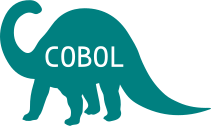

# Contexto

## ERP

<table>
<tr><td></td>
<td>Software desenvolvido internamente, com mais de 20 anos de idade e em processo de descomissionamento.</td></tr></table>

Note: This will only appear in the speaker notes window.

## Ambiente de execução

 Servidores AIX gerenciados e distribuidos por geografia.

## Tecnologias de desenvolvimento

* COBOL
* Shell script
* Perl
* C
* Python

## Conectividade

## UML

Alice : hello
Alice->Carl : HI"></img>
