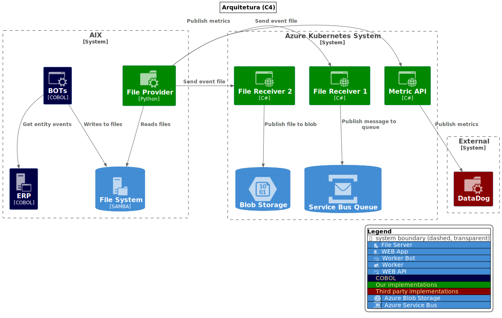
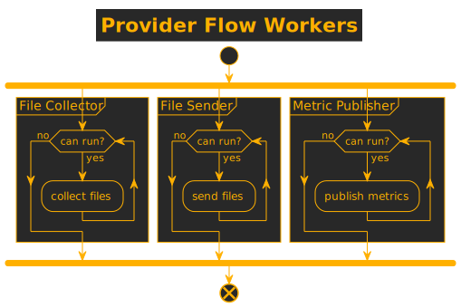
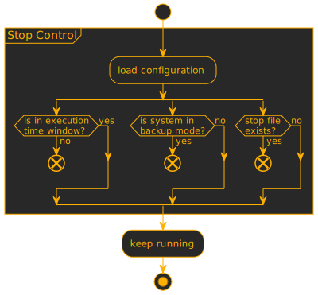
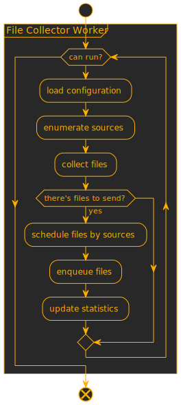
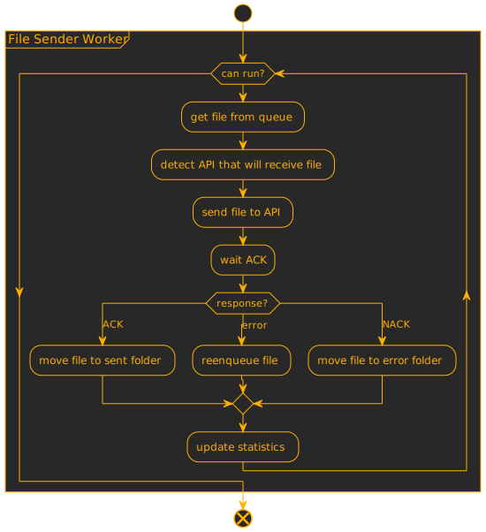
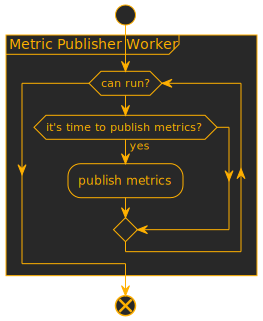

# ARQUITETURA
--
</img>
--
## Fluxo global
<table><tr><td>
</img>
</td><td>

 Configurações

 Controle de parada

 Workers

</td>
</tr>
</table>
--
## Controle de Execução
<table><tr><td>
</img>
</td><td>

 Janela de execução

 Backup

 Arquivo .STOP

</td>
</tr></table>

--
<table><tr><td>
</img>
</td><td>
<h2>Coletor de arquivos</h2>

 Configurações

 Controle de parada

 Fila interna de envio

 Produção de estatísticas

</td>
</tr></table>

--
<table><tr><td>
</img>
</td><td>
<h2>Envio</h2>

 Configurações

 Controle de parada

 Fila interna de envio

 Comunicação com receivers

 Produção de estatísticas

</td>
</tr></table>
--
<table><tr><td>
</img>
</td><td>
<h2>Publicação de Métricas</h2>

 Intervalo entre envios

 Agregação

 Envio para DataDog

</td>
</tr>
</table>

