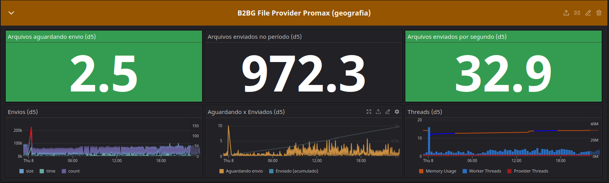
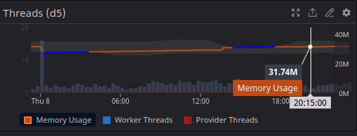
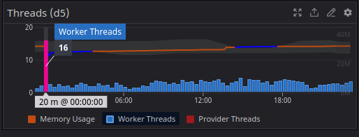

# Exemplos de Métricas

Note: Os prints a seguir foram obtidos da aplicação real, em operação no ambiente de desenvolvimento.
--
## Dashboard

Note: a produção de métricas possibilita montar dashboards de monitoramento e acompanhar o fluxo de extração de dados de forma fácil e com a notificação de anomalias.

--
## Consumo de memória

Note: O monitoramento dos workers, mesmo em produção com volume de dados dezenas de vezes maior do que o mostrado aqui, indicou que não tivemos consumo de memória além de 50MB.

--
## Escala automática de threads

Note: No nosso sistema em produção, o número de threads utilizados no envio dos arquivos é automaticamente ajustado de acordo com a demanda. Podemos ver no gráfico que houve um pico de produçao de arquivos e consequentemente o número de threads subiu, para dar vazão e evitar o acúmulo. 
