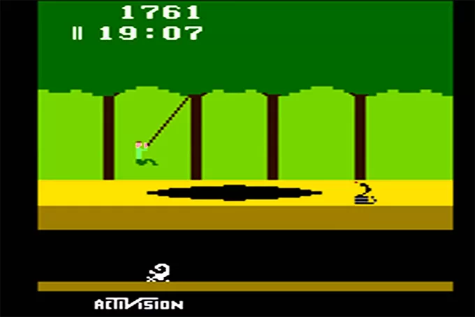

# PITFALLS

<figure height="50%">
 
<figcaption>(Activision/Reprodução)</figcaption>
</figure>

## Buraco (1)

<table>
<tr><td width="30%"></td>
<td>Ambiente AIX disponibiliza apenas python 2.6.8.</td></tr></table>

Note: Os scripts anteriores foram desenvolvidos usando a versão 2.6.8 porque era uma versão que já fazia parte da instalação default do AIX.

## Buraco (2)

<table>
<tr><td width="30%"></td>
<td>Ambiente AIX não disponibiliza o instalador de pacotes python (pip). 
Todo o desenvolvimento deve ser feito usando a biblioteca padrão.</td>
</td></tr></table>

Note: Por uma regra de segurança, todo código que roda nos ambientes AIX deve ser explicitamente testado e validado antes de ser implantado. O uso do pip permitiria a instalação facilitada de programas sem validação e isso seria uma brecha de segurança muito grave.

## Buraco (3)

<table>
<tr><td width="30%"></td>
<td>O serviço de captura de arquivos vai concorrer com centenas de outros serviços no acesso ao sistema de arquivos, memória e CPU.</td></tr></table>

Note: Uma máquina que serve uma geografia tem até 24 CPU's e 200GB de RAM e além do ERP e seus programas COBOL, tem milhares de processos em execução paralela.

## Buraco (4)

<table>
<tr><td width="30%"></td>
<td>Ambiente AIX não disponibiliza recursos de SSL para o python, impossibilitando o uso de requests HTTPS via urllib.</td></tr></table>

Note: A biblioteca openssl estava disponibilizada nos ambientes. Mas não estava devidamente configurada para o uso no python 2.6.8.  A alternativa foi utilizar o curl com processo paralelo para fazer a requisição HTTP.

## Buraco (5)

<table>
<tr><td width="30%"></td>
<td>Deve ser implementada uma rotina de <i>house-keeping</i> para remover arquivos antigos.</td></tr></table>

Note: Após o envio dos arquivos, os mesmos são movidos para pastas indicando seu processamento. Após algum tempo, estes arquivos são dispensáveis, então é necessário fazer a remoção para liberação de espaço em disco.

## Buraco (6)

<table>
<tr><td width="30%"></td>
<td>O volume de arquivos produzidos pelos robôs, em ambiente de desenvolvimento é estimado em 84 mil por iteração a cada 1 a 5 minutos. 
Em ambiente de produção pode chegar a dez vezes mais.</td></tr></table>

Note: Estes eventos são relativos a vários domínios e sua produção é controlada por robôs específicos. No contexto desse problema, não temos controle sobre a taxa de criação desses arquivos.

## Buraco (7)

<table>
<tr><td width="30%"></td>
<td>Os ambientes do AIX e do AKS estão em redes separadas. Dessa forma a latência e a banda de rede impactam no processamento.</td></tr></table>

Note: Este aspecto da latência de rede deve ser levado em consideração, pois são envios individuais de arquivos usando requisições HTTP. Cada requisição, por si só é custosa pois implica o tempo de conexão, envio do payload, recepção da resposta e validação do processo. O uso de GRPC não foi possível nesse primeiro momento, então o que nos restou foi tentar otimizar ao máximo a request HTTP.

##

 

Note: Resumindo, o problema basicamente não é complexo, mas detalhes da infraestrutura aumentam bastante o desafio.