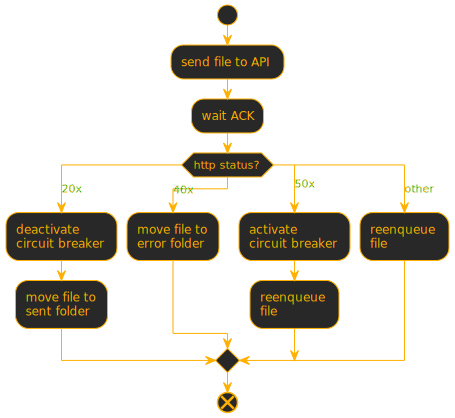

# Envio de arquivos

--

## Estratégias para enviar os arquivos coletados

--
### Estratégia 1

<ul>
<li class="fragment">Consumir os arquivos da <i>queue</i> alimentada pelo worker de coleta.</li>
<li class="fragment">A cada arquivo, identificar o serviço de recepção.</li>
<li class="fragment">Efetuar o envio via HTTP POST para a URL correspondente.</li>
<li class="fragment">Tratar a resposta da requisição HTTP: ACK, NACK, e RETRY.</li>
</ul>

Note: a restrição de utilizar python 2.6 inicialmente, nos obrigou a utilizar o cURL do sistema numa chamada externa para fazer as requests.

--
<h3><span class="mdi mdi-comment-alert"></span> Problemas da estratégia 1</h3>

<ul>
<li class="fragment">Envio via processo cURL é ineficiente. É necessário codificar um cliente HTTP.</li>
<li class="fragment">O envio sequencial não é performático. É necessário paralelizar.</li>
<li class="fragment">O tratamento dos erros 50X do serviço de recepção devem ser tratados com o padrão <i>circuit breaker</i>.</li>
</ul>

--
### Estratégia 2

<ul>
<li class="fragment"><span class="mdi mdi-head-question"/> Paralelizar o envio.</li>
<li class="fragment"><span class="mdi mdi-head-question"/> Utilizar ThreadPoolExecutor para possibilitar o controle do número de threads para o envio dos arquivos.</li>
</ul>

--
### Método com código nativo para requisição HTTP

```python
import logging
import ssl
import urllib.error
import urllib.request
import urllib.response
from typing import Tuple

CTX = ssl.create_default_context()
CTX.check_hostname = False
CTX.verify_mode = ssl.CERT_NONE


def do_http_request(request: urllib.request.Request, 
                    timeout: int) -> Tuple[int, str]:

    try:
        with urllib.request.urlopen(request,
                                    context=CTX,
                                    timeout=timeout) as response:
            code = response.code
            if 0 < response.code < 500:
                body = response.read(response.length)
            else:
                body = ''
        return code, body
    except urllib.error.HTTPError as exc:
        if exc.readable():
            response_body = exc.read().decode('utf-8', errors='ignore')
        else:
            response_body = exc.reason
        return exc.code, response_body
    except urllib.error.URLError as exc:
        logging.error('URL Error #%s %s (%s)', exc.errno,
                      exc.strerror, exc.filename)
        raise
    except NotImplementedError:
        raise
    except Exception as exc:
        logging.error('Response error %s', exc)
        raise
```
--
### Criando uma request a partir de um arquivo
```python
def get_request(method: str, url: str, filename: str) -> urllib.request.Request:
    with open(filename,'b') as file:
        data=file.read()
    if method.upper() in ['POST', 'PUT']:
        headers = {
            'Content-Type': 'application/json; charset=utf-8',
            'Content-Length': len(data)
        }

        request = urllib.request.Request(
            url, data, headers, method=method)

    elif method.upper() == 'GET':
        request = urllib.request.Request(url, data, method='GET')

    else:
        raise NotImplementedError()

    return request
```
--
### Implementando classe de Circuit Breaking

```python
import time
from datetime import datetime, timedelta


class CircuitBreaker:

    def __init__(self):
        self._receivers = {}

    def open(self, url):
        if not self._receivers.get(url):
            self._receivers[url] = datetime.now()+\
                                   timedelta(seconds=5)

    def close(self, url):
        if url in self._receivers:
            self._receivers.pop(url)

    def wait(self, url):
        if url not in self:
            return
        if self._receivers.get(url) > datetime.now():
            time.sleep(self._receivers.get(url)-datetime.now())
        self.close(url)
```

Note: Nessa classe de circuit breaking, não faremos o uso de pausas progressivas. Para fins de demonstração, o circuito aberto forçará uma pausa de 5 segundos entre requisições.
--
### Método para ler arquivo, montar request, enviar e obter o Retorno
```python
def send_file(filename: str,
              receiver_url: str,
              result_queue: queue.Queue,
              circuit_breaker: CircuitBreaker):
    circuit_breaker.wait(receiver_url)
    request = get_request('POST', receiver_url, filename)
    status_code, response_body = do_http_request(request, 30)
    if status_code >= 500:
        circuit_breaker.open(receiver_url)
    else:
        circuit_breaker.close(receiver_url)

    # Publica na fila de resultados, o retorno da operação
    result_queue.put((filename, status_code, response_body))
```
--
### Identificar serviço de recebimento

```python
def get_receiver_url(filename:str)->str:
    """
    Identifica a URL do serviço de recebimento a 
    partir do nome do arquivo.   
    """
    return "https://api.localhost:8080"
```
Note: Código mockado neste exemplo, pois usamos regras específicas e internas em produção.
--

### Enviando arquivos com um pool de threads
```python
from concurrent.futures import ThreadPoolExecutor, wait

def files_sender(scheduled_files, circuit_breaker):
    result_queue = Queue()
    
    with ThreadPoolExecutor(max_workers=4) as executor:
        futures = []
        total_done = total_not_done = 0
        
        def futures_wait():
            nonlocal futures, total_done, total_not_done
            if len(futures) == 0:
                return
            done, not_done = wait(futures)
            total_done += len(done)
            total_not_done += len(not_done)
            futures.clear()

        for filename in scheduled_files:
            receiver_url = get_receiver_url(filename)
            futures.append(
                executor.submit(send_file,
                                filename=filename,
                                receiver_url=receiver_url,
                                result_queue=result_queue,
                                circuit_breaker=circuit_breaker))
            if len(futures) == 128:
                futures_wait()

        futures_wait()

    if total_not_done > 0:
        print('Tasks not completed', total_not_done)
    print('Tasks done', total_done)
    return result_queue
```
Note: nessa função, usaremos um pool de threads para consumir a fila de arquivos e enviar concorrentemente até 4 arquivos por vez e alimentando uma nova fila com os resultados dos envios para fins de estatística.
--
### Tratamento do retorno das operações
<table><tr><td>
</img>
</td>
<td>
<ul>
<li class="fragment">20x | Aceito</li>
<li class="fragment">40x | Rejeitado</li>
<li class="fragment">50x | Erro de serviço</li>
<li class="fragment">Outras | Erro de rede</li>
</ul>
</td></tr></table>

Note:  Mover para subpasta 'error' + arquivo contendo motivo da rejeição
