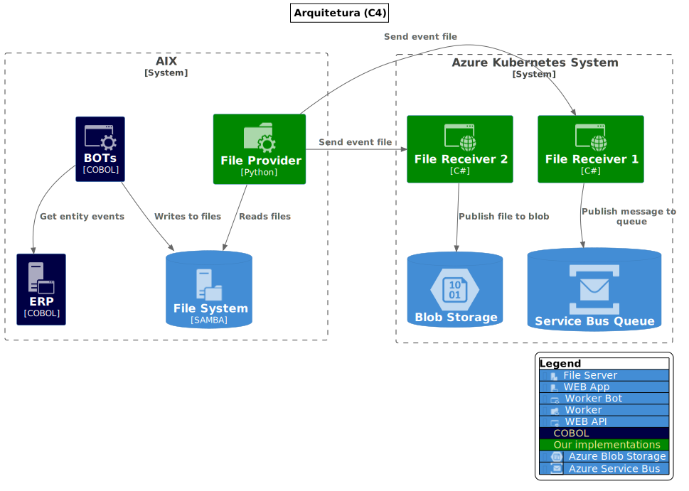

# Requisitos

## Requisitos

<table>
<tr><td width="30%"></td>
<td>ERP produzirá arquivos JSON de eventos no sistema de arquivos que deverão ser enviados para mensageria. 
Para receber estes arquivos será necessário um microsserviço de recebimento (API).
</td></tr></table>

Note: Robôs do ERP criarão arquivos JSON que

## Requisitos (v2)

<table>
<tr><td width="30%"></td>
<td>Os arquivos de eventos serão gravados em pastas diferentes correspontentes ao domínio que eles pertençam.</td></tr></table>

## Requisitos (v3)

<table>
<tr><td width="30%"></td>
<td>Além das pastas de domínio, os arquivos de eventos serão gravados em subpastas que indicam uma subdivisão de domínio e nome de fila correspondente.</td></tr></table>

## Requisitos (v4)

<table>
<tr><td width="30%"></td>
<td>Os arquivos de eventos podem ser enviados para diferentes API's de acordo com o [sub]domínio via configuração.</td></tr></table>

## Requisitos (v5)

<table>
<tr><td width="30%"></td>
<td>O processo de envio dos arquivos deve contar com um mecanismo de tratamento de falhas e retentativas.</td></tr></table>

## Requisitos (v6)

<table>
<tr><td width="30%"></td>
<td>Arquivos enviados com sucesso devem ser movidos para pasta 'sent'. 
Arquivos rejeitados pelas API devem ser movidos para pasta 'error' com registro do motivo de rejeição.</td></tr></table>

## Requisitos (v7)

<table>
<tr><td width="30%"></td>
<td>Devem ser coletadas métricas: 
- Arquivos aguardando envio, 
- Arquivos enviados, 
- Erros de envio, 
- Espaço em disco ocupado.
</td></tr></table>

## UML

</img>
